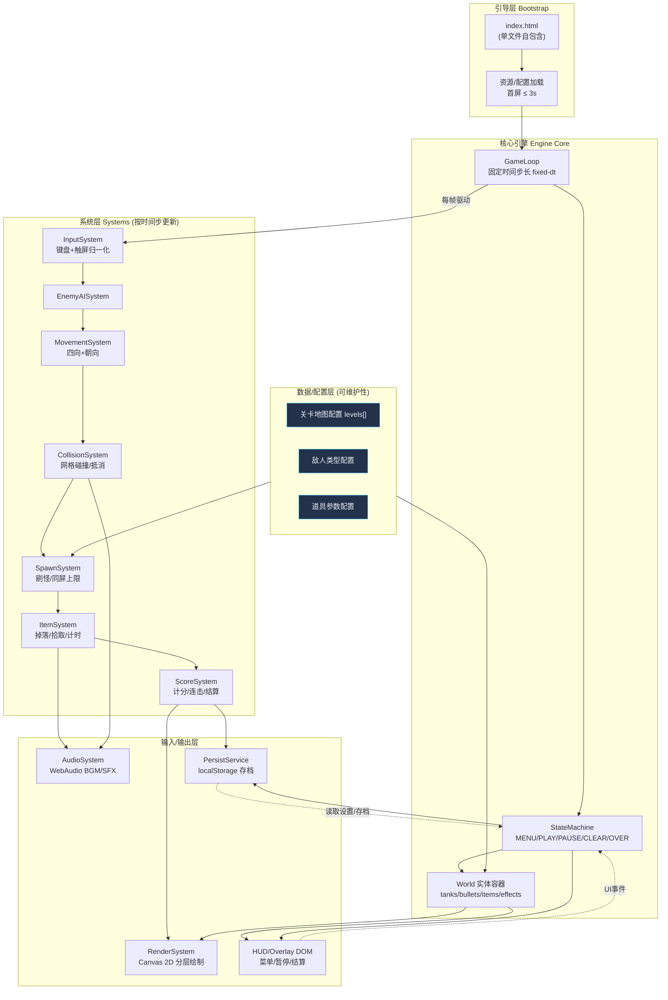
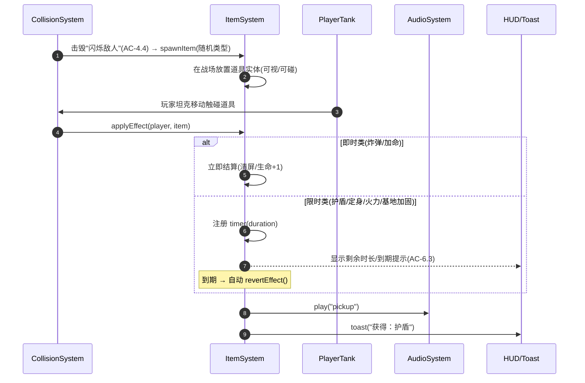
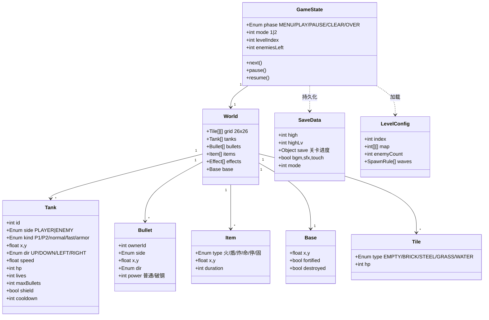

<!-- 技术方案：坦克大战豪华版 -->

# 坦克大战豪华版 —— 技术方案设计

> 定位：纯前端、离线可玩、单文件可交付的 Canvas 2D 网格射击游戏。本方案与产品已确认的交互原型保持一致（主菜单 / 单双人 / 关卡推进 / 道具 / 计分与最高分 / 暂停 / 触屏 / 音效 / 较大字号结算分数）。

---

## 1. 总体架构图



**架构要点**
- **单文件自包含**：HTML + 内联 CSS + 内联 JS，零后端、零构建即可运行（满足 NFR-2.3 / OUT-1）。
- **分层解耦**（NFR-5.3）：输入、逻辑、渲染、音频、持久化各自独立，核心逻辑系统不直接触碰 DOM/Canvas，便于单元测试。
- **数据驱动**（NFR-5.1）：关卡、敌人、道具均为纯配置对象，新增关卡只需追加数据，不改逻辑。
- **DOM/Canvas 混合**：高频战场绘制走 Canvas（性能），低频菜单/结算用 DOM Overlay（开发效率、可访问性、字号易调整——契合「结算字号放大」诉求）。

---

## 2. 关键流程时序图

### 2.1 核心战斗帧循环（固定时间步长）

```mermaid
sequenceDiagram
  autonumber
  participant RAF as requestAnimationFrame
  participant Loop as GameLoop
  participant In as InputSystem
  participant AI as EnemyAISystem
  participant Mv as MovementSystem
  participant Co as CollisionSystem
  participant Sc as ScoreSystem
  participant Au as AudioSystem
  participant Re as RenderSystem

  RAF->>Loop: tick(now)
  Loop->>Loop: acc += (now - last)
  loop 每个固定步 dt=1/60s (帧率无关 AC-3.4)
    Loop->>In: sample() 读取按键/触屏意图
    Loop->>AI: update(dt) 敌人转向/射击/趋向基地
    Loop->>Mv: update(dt) 坦克/子弹按 dt 位移
    Loop->>Co: resolve() 子弹↔坦克/地形/基地/子弹抵消
    Co-->>Sc: onKill(enemyType) 累加分值+连击
    Co-->>Au: play("explosion"/"hit")
    Co-->>Loop: 基地被击中 → 触发 GAME_OVER
  end
  Loop->>Re: render(alpha) 插值绘制分层画面
  Loop->>RAF: 注册下一帧
```

### 2.2 道具掉落 → 拾取 → 限时失效



---

## 3. 数据模型



> 实体在内存中以扁平数组维护（无 ORM/数据库）；`SaveData` 是唯一被序列化进 `localStorage` 的结构。

---

## 4. 关键接口 / 数据结构定义

```js
/* ===== 常量与枚举 ===== */
const TILE = 20, COLS = 26, ROWS = 26;          // 网格 26×26
const TS = 2 * TILE;                            // 坦克 40px
const MAXLV = 10, MAX_ENEMY_SCREEN = 4;
const Tile  = { EMPTY:0, BRICK:1, STEEL:2, GRASS:3, WATER:4 };
const Dir   = { UP:0, RIGHT:1, DOWN:2, LEFT:3 };
const Side  = { PLAYER:'P', ENEMY:'E' };
const FIXED_DT = 1/60;                           // 固定逻辑步长 (AC-3.4 / AC-NFR-1.1)

/* ===== 敌人类型配置（数据驱动 NFR-5.1）===== */
const ENEMY_TYPES = {
  normal: { speed: 48,  hp: 1, score: 100 },
  fast:   { speed: 96,  hp: 1, score: 200 },
  armor:  { speed: 36,  hp: 4, score: 400 },
};

/* ===== 道具类型（AC-6.1，共 6 种）===== */
const ITEM_TYPES = {
  fire:    { glyph:'火', timed:true,  duration:15, label:'增强火力' }, // 子弹破钢墙
  shield:  { glyph:'盾', timed:true,  duration:10, label:'护盾无敌' },
  bomb:    { glyph:'炸', timed:false,             label:'清屏'      },
  life:    { glyph:'命', timed:false,             label:'加命+1'    },
  freeze:  { glyph:'停', timed:true,  duration:8,  label:'敌人定身'  },
  fortify: { glyph:'固', timed:true,  duration:18, label:'基地加固'  },
};

/* ===== 关卡配置结构（≥10 关，AC-7.1）===== */
/** @typedef {{
 *   index:number, map:number[][],
 *   enemyCount:number,           // 本关敌人总数（默认 20）
 *   composition:{normal:number,fast:number,armor:number},
 *   itemDropCount:number         // 携带道具的"闪烁敌人"数量
 * }} LevelConfig */

/* ===== 核心系统接口（便于单测 NFR-5.3）===== */
const InputSystem = {
  sample(): { p1:Intent, p2:Intent }            // Intent = {dir?, fire:boolean}
};
const MovementSystem  = { update(world, dt): void };
const CollisionSystem = { resolve(world): CollisionEvent[] };
const EnemyAISystem   = { update(world, dt): void };
const ItemSystem      = { update(world, dt): void; apply(tank, item): void };
const ScoreSystem     = { onKill(side, kind): void; settleLevel(): ClearStats };
const RenderSystem    = { render(world, alpha): void };
const AudioSystem     = { play(name): void; toggleBgm(on): void; toggleSfx(on): void };

/* ===== 碰撞事件 ===== */
/** @typedef {{
 *   type:'kill'|'hit'|'baseHit'|'bulletCancel'|'pickup',
 *   a:number, b:number, payload?:any
 * }} CollisionEvent */

/* ===== 持久化接口（AC-12.x）===== */
const KEY = 'tankDeluxe.v1';
const PersistService = {
  load(): SaveData,                             // 解析失败回退默认，不报错 (AC-12.3)
  save(partial: Partial<SaveData>): void,       // 节流写入 localStorage
};
```

```js
/* ===== 固定时间步长主循环（帧率无关，性能可控）===== */
function gameLoop(now){
  let frame = now - last; last = now;
  if (frame > 250) frame = 250;                 // 失焦/长卡防螺旋
  acc += frame;
  while (acc >= FIXED_DT*1000){
    stepLogic(FIXED_DT);                         // 输入→AI→移动→碰撞→道具→计分
    acc -= FIXED_DT*1000;
  }
  RenderSystem.render(world, acc/(FIXED_DT*1000)); // 插值渲染
  if (state.phase === 'PLAY') requestAnimationFrame(gameLoop);
}
```

---

## 5. 技术选型与理由

| 关注点 | 选型 | 理由 |
|--------|------|------|
| 渲染 | **Canvas 2D**（非 WebGL/DOM 精灵） | 网格像素风格、实体数量有限（≤数十），2D 即可稳定 60 FPS；WebGL 复杂度过剩，DOM 精灵在高频更新下性能差（NFR-1.1）。 |
| UI/菜单 | **DOM Overlay + CSS** | 菜单/暂停/结算为低频界面，DOM 开发快、字号/无障碍可控，便于满足「结算字号放大」与响应式自适应（NFR-2.2）。 |
| 游戏循环 | **固定时间步长 + 插值** | 保证不同帧率设备速度一致（AC-3.4），逻辑确定性利于单测与重放。 |
| 音频 | **Web Audio API**（程序化合成 + 少量采样） | 零外部资源、体积小（NFR-1.2 ≤5MB）；需用户首次交互后 `resume()` 解锁（浏览器自动播放策略）。 |
| 状态管理 | **轻量有限状态机（FSM）** | 菜单/游戏/暂停/结算切换清晰；失焦自动暂停（AC-9.3）只需监听 `visibilitychange` 切 FSM。 |
| 持久化 | **localStorage（单键 JSON）** | 纯前端、跨会话、无需后端（AC-12.1）；只存分数与设置，无 PII（NFR-3.1）。 |
| 输入 | **键盘事件 + 触屏 Pointer 事件归一化为 Intent** | 桌面/平板统一处理，双人同键盘互不干扰（FR-10）。 |
| 语言/构建 | **原生 ES（无框架、无打包）** | 单文件交付、首屏快、无第三方高危依赖（NFR-3.2）；可选 `<script type="module">` 拆分仅用于开发期单测。 |
| 测试 | **Vitest/Jest 对纯逻辑系统单测** | 逻辑系统不依赖 DOM，可在 Node 下覆盖碰撞/计分/道具（NFR-5.3）。 |

---

## 6. 实现步骤拆解（研发任务清单）

**M0 — 骨架与引擎（基础设施）**
- [ ] T0.1 单文件 HTML 骨架：topbar / canvas / overlay 容器 / HUD（对齐原型 DOM 结构）。
- [ ] T0.2 固定时间步长 `GameLoop` + FSM（MENU/PLAY/PAUSE/CLEAR/OVER）。
- [ ] T0.3 `World` 实体容器与网格数据结构（26×26）。
- [ ] T0.4 `PersistService`：`load/save`，解析失败回退默认（AC-12.3）。

**M1 — 核心玩法（G1）**
- [ ] T1.1 地形渲染 + 4 种地形碰撞规则（砖/钢/草/水，AC-2.2/2.3）。
- [ ] T1.2 玩家坦克四向移动 + 朝向 + 按 dt 位移（FR-3）。
- [ ] T1.3 子弹发射、同屏上限、直线运动（AC-3.3）。
- [ ] T1.4 `CollisionSystem`：子弹↔坦克/地形/基地、子弹互相抵消、坦克防穿透（FR-5）。
- [ ] T1.5 基地被击中 → GAME_OVER（AC-5.3）。
- [ ] T1.6 输入层：P1 方向键+空格 / P2 WASD+F（FR-3/FR-10）。

**M2 — 敌人 AI 与刷怪（G1）**
- [ ] T2.1 三种敌人类型配置与属性（AC-4.2）。
- [ ] T2.2 `SpawnSystem`：总数 20 / 同屏上限 4（AC-4.1）。
- [ ] T2.3 `EnemyAISystem`：移动/转向/射击/趋向基地（AC-4.3）。
- [ ] T2.4 闪烁敌人掉落道具标记（AC-4.4）。

**M3 — 豪华版增量（G2）**
- [ ] T3.1 道具系统：6 种效果 + 限时计时 + 到期回滚 + 提示（FR-6）。
- [ ] T3.2 计分/连击 + HUD 实时显示（分数/生命/关卡/剩余敌人，AC-8.1）。
- [ ] T3.3 关卡系统：≥10 关配置、过关检测、难度递增（FR-7）。
- [ ] T3.4 结算界面：单关结算 + 通关/失败结算（**结算分数字体放大，落实评审修订**，AC-8.2/8.3）。
- [ ] T3.5 音效与爆炸特效 + BGM/SFX 独立开关与持久化（FR-11）。

**M4 — 状态控制与多模式（G3）**
- [ ] T4.1 暂停/继续/重开/返回菜单 + 失焦自动暂停（FR-9）。
- [ ] T4.2 双人合作：双坦克、独立按键、独立计分、退出规则（FR-10）。
- [ ] T4.3 「继续游戏」从上次关卡恢复（AC-12.2）。

**M5 — 适配、质量与交付（G4/G5/NFR）**
- [ ] T5.1 触屏虚拟方向键 + 射击按钮（AC-NFR-2.2）。
- [ ] T5.2 响应式自适应 ≥1024×768、画面缩放。
- [ ] T5.3 全局异常捕获、友好提示、不白屏（AC-NFR-4.2）。
- [ ] T5.4 核心逻辑系统单元测试（碰撞/计分/道具/AI 趋向）。
- [ ] T5.5 性能压测：60 FPS / 输入延迟 ≤50ms / 资源 ≤5MB / 首屏 ≤3s。

---

## 7. 风险与权衡

| 风险 / 权衡 | 影响 | 应对策略 |
|-------------|------|----------|
| **单文件巨型 JS 难维护** | 后期可读性、协作冲突 | 开发期用 ES module 多文件 + 单测，**交付时合并/内联**为单文件；逻辑系统保持纯函数化。 |
| **音频自动播放被浏览器拦截** | BGM 无声 | 首次用户交互（点击「开始」）后 `AudioContext.resume()`；设置项默认 BGM 关、SFX 开（与原型默认一致）。 |
| **固定步长 vs 渲染插值复杂度** | 实现成本上升 | 子弹/坦克高速实体启用插值，特效可不插值；用 `accumulator` 上限防"死亡螺旋"（失焦/卡顿）。 |
| **AI「趋向基地」过强或过弱** | 难度失衡 | AI 采用加权随机（趋基地权重 + 随机转向 + 视线开火），权重纳入关卡配置可调（NFR-5.1）。 |
| **双人同键盘按键冲突 / 键盘 Ghosting** | 双人手感差 | 选用低冲突键位（方向键+空格 vs WASD+F）；用 `code` 而非 `key` 判定，状态化按键集合避免 keyrepeat。 |
| **触屏与桌面体验取舍** | 平板手感 | 触屏仅做「基础可玩」（OUT-7），方向键支持滑动切向；不追求与键盘等同的精度。 |
| **localStorage 容量/隐私模式不可写** | 存档失败 | 全部读写 try/catch 静默降级为内存态，游戏仍可玩（AC-12.3）；只存极小 JSON。 |
| **网格碰撞在 40px 坦克 / 20px 砖块下的对齐** | 卡墙、抖动 | 坦克移动按子格对齐（半格步进）+ AABB 与网格求交；砖墙以 20px 子块为最小可摧毁单元。 |
| **性能在中低端设备退化** | 帧率不达标 | 离屏缓存静态地形、草丛/水做整层批绘；实体数受同屏上限约束（≤4 敌 + 子弹）；中低端目标降为 ≥30 FPS（NFR-1.1）。 |
| **关卡仅内置、无编辑器** | 内容量有限 | 本期接受（OUT-5），地图以配置数组定义，V2 可低成本扩展为编辑器。 |

---

> 备注：评审修订项「游戏结束次数/分数字体放大两号」已落入 **T3.4 结算界面**——结算分数采用独立放大字号（原型中 `.big-score` 类，相对正文显著增大），并与历史最高分对比、刷新记录时高亮提示。
