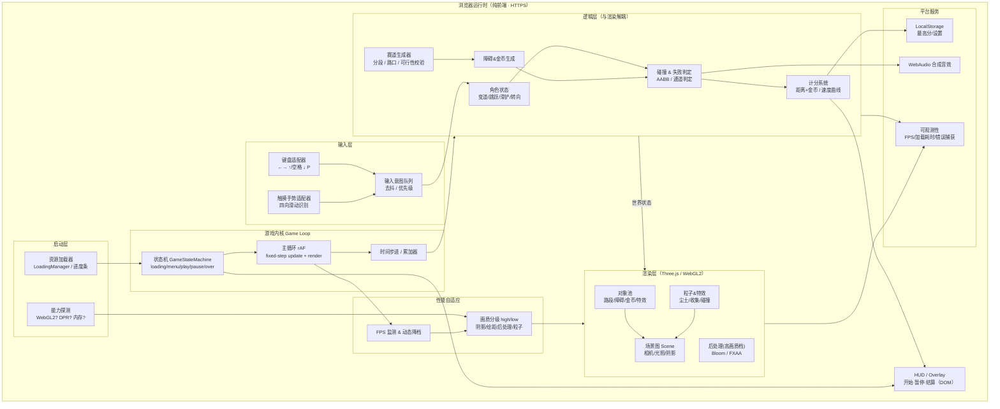
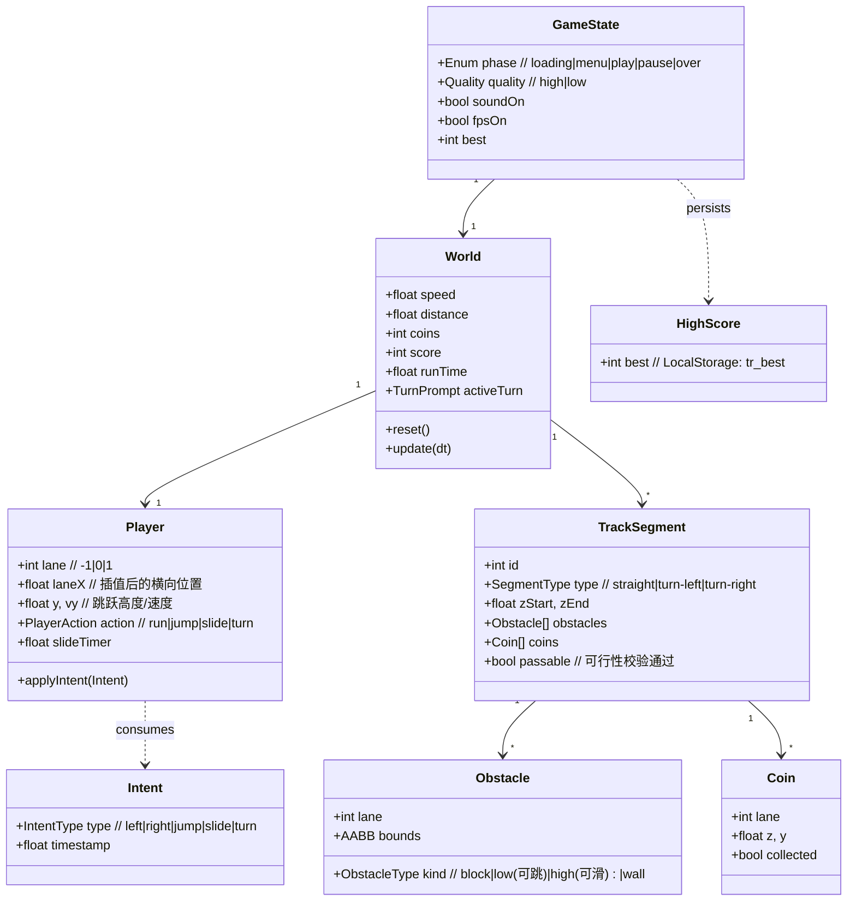

<!-- 技术方案：神庙逃亡 -->

# 神庙逃亡在线版 — 技术方案设计

> 本方案以「画质好看」与「运行流畅」为最高优先级，采用 **WebGL（Three.js）真 3D 渲染**满足 FR-9 的 3D 场景/光影/特效诉求，同时严格沿用产品已评审原型的**交互、HUD/结算/暂停界面、玩法闭环与键位/手势**。纯前端、即点即玩、最高分本地保存。

---

## 1. 总体架构图



**数据流要点**
- 输入 → 意图队列（去抖/优先级）→ 逻辑层，逻辑层与渲染层**解耦**：逻辑只产出"世界状态"，渲染层据此更新场景图。
- 赛道生成器持续在角色前方生成路段，远端路段经对象池回收，避免内存无限增长（FR-4 / NFR-8）。
- FPS 监测驱动画质分级动态降档，优先保帧率（NFR-1 / NFR-5）。

---

## 2. 关键流程时序图

### 2.1 场景 A：单帧主循环（输入 → 逻辑 → 渲染 → 计分）

```mermaid
sequenceDiagram
  autonumber
  participant rAF as requestAnimationFrame
  participant Loop as GameLoop
  participant In as 输入意图队列
  participant Logic as 逻辑层
  participant Col as 碰撞判定
  participant Render as 渲染层(Three.js)
  participant UI as HUD

  rAF->>Loop: tick(now)
  Loop->>Loop: dt = clamp(now - last)；累加器 += dt
  loop 固定步长 update（fixedStep）
    Loop->>In: 取出本步输入意图(变道/跳跃/滑铲/转向)
    In-->>Logic: 应用意图(优先级去重)
    Loop->>Logic: 推进角色/赛道/速度曲线
    Logic->>Col: 检测障碍碰撞 & 冲出赛道
    alt 命中障碍 / 冲出赛道
      Col-->>Loop: 触发 GameOver
    else 安全
      Col->>Logic: 金币吸收→coins++
    end
  end
  Loop->>Render: render(插值后的世界状态, alpha)
  Render->>Render: 更新对象池/光影/粒子
  Loop->>UI: 刷新 距离/金币/分数/FPS
  Loop->>rAF: 预约下一帧
```

### 2.2 场景 B：失败 → 结算 → 一键重开

```mermaid
sequenceDiagram
  autonumber
  participant Logic as 逻辑层
  participant GSM as 状态机
  participant Store as LocalStorage
  participant Audio as 音效
  participant Over as 结算Overlay
  participant Pool as 对象池

  Logic->>GSM: onGameOver(reason)
  GSM->>GSM: state = OVER（暂停 update）
  GSM->>Audio: 播放碰撞音效
  GSM->>Store: best = max(best, score)
  alt 刷新纪录
    Store-->>Over: isNewBest = true
    Over->>Over: 显示「🏆 新纪录！」
  end
  GSM->>Over: 展示 分数/距离/金币/历史最高
  Note over Over: 玩家点击「再来一局」
  Over->>GSM: restart()
  GSM->>Pool: 回收全部路段/障碍/金币/粒子
  GSM->>Logic: resetWorld()（速度/距离/金币/角色复位）
  GSM->>GSM: state = PLAY
```

---

## 3. 数据模型



> 纯前端无后端实体，持久化仅 `localStorage['tr_best']` 与设置项；上表为运行时内存对象模型。

---

## 4. 关键接口 / 数据结构定义

```typescript
// ---------- 全局枚举 ----------
type Phase   = 'loading' | 'menu' | 'play' | 'pause' | 'over';
type Quality = 'high' | 'low';
type IntentType = 'left' | 'right' | 'jump' | 'slide' | 'turn';
type ObstacleKind = 'block' | 'low' | 'high' | 'wall'; // low=可跳, high=可滑铲
type SegmentType = 'straight' | 'turn-left' | 'turn-right';

// ---------- 输入适配器（键盘/触摸统一产出 Intent） ----------
interface InputAdapter {
  poll(): Intent[];                 // 取出本帧累积的意图
  reset(): void;
}
interface Intent { type: IntentType; ts: number; }

// 意图去抖 & 优先级（AC-3.5：同时上滑下滑等冲突处理）
// 优先级：jump/slide 互斥取最新；turn 优先于 left/right（在路口）
interface IntentResolver {
  resolve(raw: Intent[]): Intent[];
}

// ---------- 状态机 ----------
interface GameStateMachine {
  phase: Phase;
  start(): void;       // menu -> play（资源就绪前禁用）
  pause(): void;       // play -> pause（含失焦自动暂停 AC-8.3）
  resume(): void;      // pause -> play
  gameOver(reason: 'collision' | 'offtrack'): void;
  restart(): void;     // 完全复位（AC-7.3）
  toMenu(): void;
}

// ---------- 主循环（固定步长，渲染解耦） ----------
interface GameLoop {
  readonly FIXED_DT: number;        // e.g. 1/120s 逻辑步长
  start(): void;
  // update(dt) 推进逻辑；render(alpha) 用插值因子绘制，避免抖动
  tick(now: number): void;
}

// ---------- 赛道生成（FR-4） ----------
interface TrackGenerator {
  // 持续在 cameraZ 前方生成，保证视野内无空洞
  ensureAhead(cameraZ: number, maxAhead: number): void;
  recycleBehind(cameraZ: number): void;     // 回收并归还对象池
  // 生成后做可行性校验：保证存在可通过路线（AC-4.2）
  validatePassable(seg: TrackSegment): boolean;
}

// ---------- 碰撞与判定（FR-5，判定与画面一致 AC-5.3） ----------
interface CollisionSystem {
  // 角色 AABB 与障碍 AABB；跳跃高度/滑铲姿态影响纵向通道
  check(player: Player, seg: TrackSegment): null | 'collision';
  // 路口未转向冲出赛道
  checkOffTrack(player: Player, activeTurn: TurnPrompt | null): boolean;
}

// ---------- 性能自适应（NFR-5） ----------
interface QualityController {
  apply(q: Quality): void;          // 阴影/后处理/粒子数/绘制距离
  // 连续 N 帧低于阈值 -> 自动降档；恢复后可回升（带迟滞）
  autoTune(fpsAvg: number): Quality;
}

// ---------- 持久化 / 可观测性 ----------
interface Storage {
  getBest(): number;                // localStorage 'tr_best'
  setBest(v: number): void;
  getSettings(): { quality: Quality; soundOn: boolean; fpsOn: boolean };
  saveSettings(s: object): void;
}
interface Telemetry {
  fps(): number;
  markLoadDone(): void;             // 加载耗时
  onError(handler: (e: ErrorEvent | PromiseRejectionEvent) => void): void;
}
```

```javascript
// 计分与速度曲线（沿用原型常量语义，FR-2/FR-6）
const SPEED = { start: 13, max: 30, accelPerSec: 0.18 };
function speedAt(t) {            // 平滑递增、存在上限（AC-2.2/2.3）
  return Math.min(SPEED.max, SPEED.start + SPEED.accelPerSec * t);
}
function score(distance, coins) {  // 距离 + 金币加权
  return Math.floor(distance) + coins * 10;
}
```

---

## 5. 技术选型与理由

| 领域 | 选型 | 理由 |
|---|---|---|
| 渲染引擎 | **Three.js（WebGL2，WebGL1 降级）** | FR-9 要求真 3D 模型/光影/阴影/材质；Three.js 成熟、生态完整、阴影与后处理（Bloom/FXAA）开箱即用，能在「好看」与「可控性能」间平衡。优于直接裸写 WebGL（开发成本）与 Babylon.js（包体偏大）。原型的 Canvas2D 伪 3D 仅作交互验证，正式版升级为真 3D 但**保持玩法与 UI 一致**。 |
| 资源格式 | **glTF 2.0 (.glb) + Draco/KTX2 压缩** | 体积小、加载快，满足 NFR-2（≤5s 首屏）；支持渐进加载。 |
| 主循环 | **固定步长 update + 渲染插值（rAF）** | 逻辑与帧率解耦，保证不同设备物理一致、输入响应稳定（NFR-3 ≤100ms），消除掉帧导致的穿模/抖动。 |
| UI 层 | **DOM/CSS Overlay（沿用原型）** | 开始/暂停/结算/HUD 直接复用已评审原型的 HTML/CSS，视觉一致、可读、响应式；与 Canvas 分层，互不阻塞渲染。 |
| 音效 | **WebAudio 合成（沿用原型）** | 无外部音频资源、零额外加载、跨端一致。 |
| 构建/打包 | **Vite + ESBuild** | 快速构建、代码分割、产物可缓存（NFR-2 二次访问更快）；输出静态资源走 CDN + 长缓存。 |
| 持久化 | **LocalStorage** | 仅最高分与设置，纯前端、无隐私数据（NFR-6）。 |
| 部署 | **静态托管 + HTTPS + 强缓存（hash 文件名）** | 纯前端、即点即玩；CDN 加速首屏与二次加载。 |
| 可观测性 | **`window.onerror` / `unhandledrejection` + rAF FPS 采样** | 捕获运行时异常、加载失败、帧率，便于定位卡顿/崩溃（NFR-7）。 |
| 对象池 | **自研 Pool（路段/障碍/金币/粒子）** | 避免运行时频繁 GC 造成的渐进掉帧（NFR-1/NFR-8）。 |

---

## 6. 实现步骤拆解（研发任务清单）

**M0 工程脚手架与能力探测**
- [ ] Vite + Three.js 工程初始化，目录分层（boot/core/input/logic/render/platform/ui）。
- [ ] WebGL2/WebGL1 能力探测；不可用时显示原型 `#warn` 友好降级（NFR-4）。
- [ ] LoadingManager 接资源加载进度 → 原型加载条/百分比（AC-1.3）。

**M1 渲染骨架与场景（画质基线）**
- [ ] Scene/Camera/Renderer + 第三人称跟随相机；基础光照 + 阴影 + 材质（AC-9.1）。
- [ ] glTF 角色模型 + 奔跑/跳跃/滑铲/转向动画（AnimationMixer）。
- [ ] 后处理（Bloom/FXAA）仅高画质档启用。

**M2 主循环与状态机**
- [ ] 固定步长 update + 渲染插值；GameStateMachine（loading/menu/play/pause/over）。
- [ ] 失焦/切后台自动暂停（AC-8.3）；响应式画布缩放（NFR-4）。

**M3 角色控制与输入（手感核心）**
- [ ] 键盘适配器（←→ ↑/空格 ↓ P）+ 触摸四向滑动识别（AC-3.4）。
- [ ] Intent 去抖与优先级（AC-3.5）；变道插值、跳跃/重力、滑铲计时。
- [ ] 输入→响应延迟测量，确保 ≤100ms（NFR-3）。

**M4 赛道生成与对象池（无尽）**
- [ ] 分段生成器（直道/转弯/障碍/金币组合）+ 可行性校验（AC-4.2）。
- [ ] 视野前方持续生成、身后回收；对象池复用（AC-4.1/4.3、NFR-8）。
- [ ] 路口转向逻辑与转向提示箭头（AC-3.1）。

**M5 碰撞、失败与计分**
- [ ] AABB 碰撞 + 跳跃/滑铲通道判定；冲出赛道判定（FR-5）。
- [ ] 判定与画面一致性校准（AC-5.3）。
- [ ] 速度曲线、距离/金币/分数实时 HUD（FR-2/FR-6）；金币吸收与计数。

**M6 结算/暂停/重开闭环**
- [ ] 结算 Overlay（分数/距离/金币/最高分/新纪录）；最高分 LocalStorage（FR-6/FR-7）。
- [ ] 一键重开完全复位、暂停/恢复一致性（AC-7.3/8.2）。

**M7 特效与音效（观感）**
- [ ] 尘土/收集/碰撞粒子特效（AC-9.2）；WebAudio 音效绑定。
- [ ] flash 文字提示（连击/转向等）沿用原型。

**M8 性能自适应与可观测性**
- [ ] 画质分级 high/low（阴影/绘距/粒子/后处理）+ FPS 动态降档迟滞（NFR-5）。
- [ ] FPS/加载耗时面板、全局错误捕获与日志（NFR-7）。

**M9 兼容性、稳定性与验收**
- [ ] Chrome/Edge/Safari/Firefox + 桌面/移动横竖屏适配（NFR-4）。
- [ ] ≥10 分钟连续游玩内存/帧率回归（NFR-8）；首屏 ≤5s、稳定 ≥60/30 FPS 验收（NFR-1/2）。

---

## 7. 风险与权衡

| 风险 | 影响 | 应对 / 权衡 |
|---|---|---|
| **真 3D（Three.js）与原型 Canvas2D 伪 3D 的偏差** | 实现成本上升，且需确认产品认可"视觉升级但玩法/UI 一致" | 玩法规则、车道布局、HUD/结算/键位严格对齐原型；仅渲染管线升级为真 3D。**建议向产品确认该升级口径**（FR-9 与原型存在张力）。 |
| **中低端移动设备帧率达标（NFR-1）** | 卡顿误死、体验崩坏 | 画质分级 + FPS 动态降档（关阴影/后处理、减绘距与粒子）；对象池消除 GC 抖动；固定步长保物理一致。优先保帧率而非画质。 |
| **首屏 ≤5s 与高画质资源体积冲突** | 加载慢、跳出 | glb + Draco/KTX2 压缩、关键资源优先 + 渐进加载、CDN 强缓存；高画质贴图懒加载/分档。 |
| **碰撞判定与画面错位（AC-5.3）** | "看着躲过却判死"的劣质手感 | 判定基于逻辑层世界坐标而非渲染插值帧；可视化调试盒校准；保留判定容差。 |
| **无尽生成的可通过性（AC-4.2）** | 出现不可解组合直接死 | 生成后 `validatePassable` 校验，保证至少一条可行车道/通道；模板化拼接降低随机风险。 |
| **长时间游玩内存泄漏（NFR-8）** | 渐进掉帧/崩溃 | 全量对象池 + 路段回收；纹理/几何体显式 dispose；监控堆增长。 |
| **WebGL 不可用 / 老旧浏览器（NFR-4）** | 白屏崩溃 | 启动能力探测，命中原型 `#warn` 友好提示而非崩溃；不强行 Canvas2D 兜底（玩法体验差）。 |
| **触摸手势与误触（AC-3.4/3.5）** | 误操作、丢输入 | 滑动方向阈值 + 去抖；冲突意图按优先级取最新；`touch-action:none` 防系统手势干扰。 |
| **纯前端无反作弊（边界外）** | 本地分数可改 | 明确不在范围（无在线榜单，作弊不影响他人）；仅本地展示。 |

---

> 备注：本方案在渲染上将原型从 Canvas2D 伪 3D 升级为 WebGL 真 3D 以达成 FR-9「画质好看」，但**玩法闭环、交互手势、键位与 HUD/结算/暂停界面均严格保持与已评审原型一致**。若产品要求视觉也完全锁定原型 Canvas2D 风格，则需就 FR-9（3D/光影/阴影）的达成口径另行对齐——这是当前规格中唯一需要产品确认的关键决策点。
