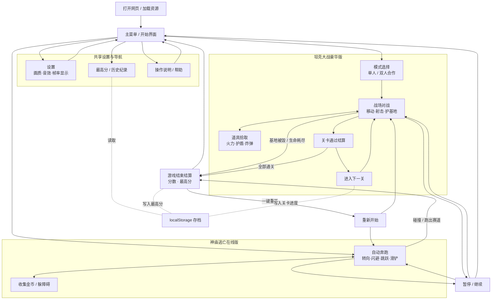
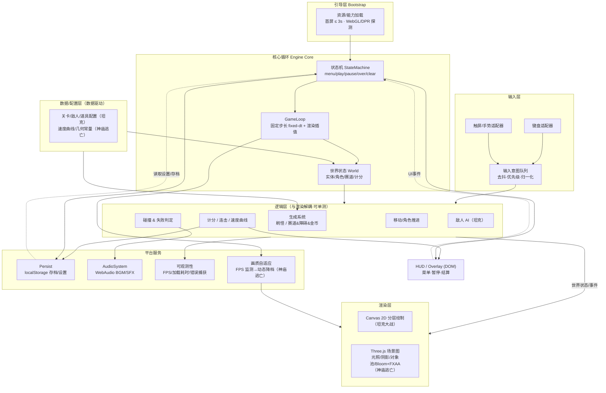
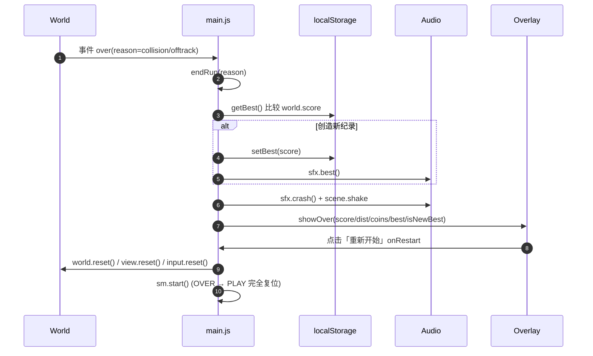
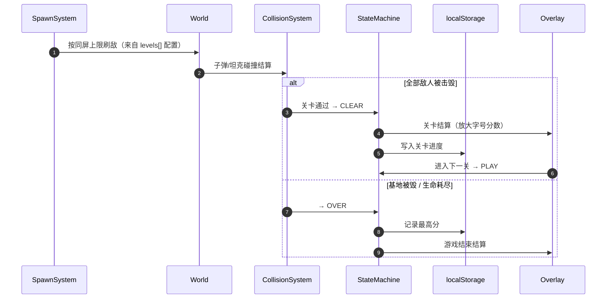

调研完成,磁盘上的检出是「神庙逃亡在线版」(`package.json` name=`temple-run-online`,Three.js 多模块),而「坦克大战豪华版」是同项目下的另一工作项(Canvas 2D 单文件),当前未在此检出中。下面综合两个工作项产出统一知识库。

---

# 网页游戏合集 · 项目知识库

> 范围：本知识库覆盖同一项目下的两个已完成工作项——**坦克大战豪华版**（经典 2D 网格射击）与**神庙逃亡在线版**（3D 无尽跑酷）。两者共享同一套「纯前端、即点即玩、本地存档」的工程哲学与游戏循环骨架，下文在各章节中综合呈现并标注差异。

---

## 1. 项目简介与目标

本项目是一套**纯前端、免安装、浏览器即点即玩的网页小游戏合集**，面向怀旧玩家与休闲玩家，让用户无需下载、注册或后端账号即可在浏览器中重温/体验经典街机玩法。合集包含两款独立交付的游戏：

| 工作项 | 一句话定位 | 技术内核 | 交付形态 | 阶段 |
|---|---|---|---|---|
| **坦克大战豪华版** | 经典 Battle City 复刻 + 关卡/道具/计分/音效/双人「豪华」增量 | Canvas 2D 网格渲染 | 单文件自包含 HTML | 完成 |
| **神庙逃亡在线版** | 第三人称 3D 无尽跑酷，主打「画质好看 + 运行流畅」 | WebGL2 / Three.js 真 3D | 静态包（`index.html + src/ + vendor/`） | 完成 |

两款游戏共同解决的核心问题：**经典/精品玩法的网页化分发门槛**——以零安装、首屏快速可玩、跨桌面与触屏的方式交付完整的「开始 → 操作 → 失败/通关 → 计分 → 重开」闭环，并在本地保存最高分与进度。

**共同设计目标**
- 免安装、加载快（首屏可玩 ≤ 3s），主流桌面 + 平板/手机浏览器可玩。
- 键盘与触屏双输入。
- 帧率无关的稳定手感（固定时间步长循环）。
- 逻辑层与渲染层解耦，纯逻辑可单测。
- 本地保存最高分/进度/设置（localStorage），无联网、无账号、无内购、无在线对战（双方共同「非目标」）。

---

## 2. 功能交互地图

下图综合两款游戏的页面/模块与用户流转。两者共享「主菜单 → 游玩 → 结算 → 重开/返回」主干，差异在于坦克大战有关卡推进与道具拾取分支，神庙逃亡为单局无尽跑酷。



---

## 3. 技术架构总览

两款游戏采用**同构的分层架构**——引导层 → 核心循环 → 输入 → 逻辑（与渲染解耦）→ 渲染 → 平台服务 → 数据/UI 覆盖层——仅在渲染技术与交付形态上分化。

### 3.1 综合整体架构图



### 3.2 模块/组件划分

| 层 | 坦克大战豪华版 | 神庙逃亡在线版 |
|---|---|---|
| 入口/引导 | `index.html`（单文件自包含） | `index.html` + `src/main.js`（能力探测→渐进加载→编排） |
| 核心循环 | `GameLoop` / `StateMachine`（`src/game.js`） | `src/core/loop.js` + `src/core/state.js` |
| 输入 | 键盘 P1/P2 + 触屏（`src/game.js`） | `src/input/input.js`（键盘 + 四向滑动 → 意图队列） |
| 逻辑（可单测） | `src/logic.js`（常量/地形/碰撞/计分/关卡/地图生成） | `src/logic/world.js`、`track.js`、`collision.js`、`config.js` |
| 渲染 | Canvas 2D 分层绘制（`src/game.js`） | `src/render/scene.js`、`character.js`、`pools.js`、`quality.js` |
| 平台服务 | localStorage 存档、WebAudio | `src/platform/storage.js`、`audio.js`、`telemetry.js` |
| UI 覆盖层 | DOM Overlay 菜单/暂停/结算（`index.html`） | `src/ui/ui.js`（复用原型 DOM/CSS） |

### 3.3 技术栈

| 维度 | 坦克大战豪华版 | 神庙逃亡在线版 |
|---|---|---|
| 渲染 | 原生 **Canvas 2D** | **WebGL2 / Three.js 0.160.0**（含 postprocessing/shaders） |
| 语言/模块 | 内联 JS（单文件） | ES Module + importmap |
| 后端 | 无（纯前端） | 无（纯前端） |
| 存储 | localStorage | localStorage |
| 音频 | WebAudio | WebAudio（合成音效） |
| 构建/运行 | 零构建，直接打开 | `serve.js`（dev）/ `build.js`（产出 `dist/`），`three` 内置于 `vendor/` |
| 测试 | Vitest（仅逻辑层 `logic.js`） | Vitest（逻辑/核心/输入/平台/画质多套单测） |
| 部署 | 单个 HTML 文件 | `dist/` 上传任意 HTTPS 静态托管 |

### 3.4 数据模型

**坦克大战（数据驱动配置 + 运行时实体）**
- 配置：`levels[]`（关卡地图）、敌人类型配置、道具参数配置（纯配置对象，新增关卡只追加数据）。
- 网格：`COLS/ROWS = 26×26`、`SPAWN_COLS`（出生列）、`FORT/base`（基地）、地形枚举（砖/钢/草/水）。
- 运行时 World：`tanks / bullets / items / effects` 实体容器。

**神庙逃亡（常量 + 世界状态，来自 `src/config.js`）**
- 赛道几何：`LANE_W=1.42`、`LANES=[-1.42,0,1.42]`（三车道）、`ROW_GAP=6.2`、`ROAD_HALF`。
- 速度曲线：`SPEED={start:13, max:30, accelPerSec:0.18}`，`speedAt(t)=min(max, start+accel·t)`。
- 跳跃/滑铲：`JUMP_V=8.2`、`GRAV=22.0`、`SLIDE_T=0.62`、`JUMP_CLEAR=1.0`、`LANE_LERP=14`。
- 计分：`scoreOf(distance, coins)=floor(distance)+coins·10`。
- 循环：`FIXED_DT=1/120`、`MAX_FRAME=0.1`。
- 存档：`{ best, settings:{quality, soundOn, fpsOn} }`。

---

## 4. 关键流程时序

### 4.1 核心战斗/跑酷帧循环（固定时间步长，两款共通骨架）

```mermaid
sequenceDiagram
  autonumber
  participant RAF as requestAnimationFrame
  participant Loop as GameLoop
  participant In as InputSystem/意图队列
  participant Logic as 逻辑层(World/AI/Move)
  participant Co as CollisionSystem
  participant Sc as ScoreSystem
  participant Au as AudioSystem
  participant Re as RenderSystem
  RAF->>Loop: tick(now)
  Loop->>Loop: acc += clamp(now - last, MAX_FRAME)
  loop 每个固定步 dt (坦克1/60s · 神庙1/120s)
    Loop->>In: 采样按键/触屏意图
    Loop->>Logic: update(dt) 推进角色/敌人/赛道
    Loop->>Co: resolve() 碰撞/通道/失败判定
    Co->>Sc: 命中/拾取/距离 → 计分/连击
    Co->>Au: 触发 SFX（射击/碰撞/金币/跳跃）
  end
  Loop->>Re: render(插值 alpha) 绘制世界状态
  Re->>RAF: 申请下一帧
```

### 4.2 神庙逃亡：失败结算与一键重开（基于 `src/main.js`）



### 4.3 坦克大战：关卡推进闭环



---

## 5. 需求 ↔ 代码追溯总览

> 综合两份 RTM。**共同测试现状**：自动化单测只覆盖**纯逻辑层**；渲染、AI、音频、HUD、持久化、状态机等依赖浏览器的部分**无自动化测试**，靠手动/集成验收（AT-xx / TC-xx）。这是两款游戏共同的主要测试缺口。

### 5.1 坦克大战豪华版

| AC/功能 | 业务释义 | 实现代码 | 测试 | 状态 |
|---|---|---|---|---|
| AC-1.1 | 加载即见主菜单（开始/模式/设置/最高分/帮助） | `index.html:107-118`、`src/game.js:613` | 手动 AT-A1 | 已实现 |
| AC-1.2 | 子界面可进入且可返回主菜单 | `src/game.js:528-548`、`:427`(showOnly) | 手动 AT-A2 | 已实现 |
| AC-1.3 | 鼠标 + 键盘（方向键+回车）双导航 | `src/game.js:511-525`、`:495`；`index.html:41` | 手动 AT-A3/A4 | 已实现 |
| AC-2.1 | 26×26 网格、玩家/≥2 敌人出生点、受保护基地 | `src/logic.js:15,45,69-96`；`src/game.js:110-112` | `logic.test.js:9-17,108-128` | 已实现 |
| AC-2.2 | ≥4 种地形（砖/钢/草/水）外观可分、行为各异 | `src/logic.js:21,84`；`src/game.js:351-365,389-394` | `logic.test.js:31-45` | 已实现 |
| AC-2.3 | 坦克阻挡砖/钢/水；子弹削砖、打钢无效、穿草/水 | `src/logic.js:99,102,110-128`；`src/game.js:226-238` | `logic.test.js:31-45,54-70` | 已实现 |
| AC-3.1 | P1=方向键+空格、P2=WASD+F；帮助可查按键 | `src/game.js:181-191` | 手动 | 已实现 |

### 5.2 神庙逃亡在线版

| AC/功能 | 业务释义 | 实现代码 | 测试 | 状态 |
|---|---|---|---|---|
| AC-1.1 | 访问即见开始界面（标题/说明/三组开关），免登录 | `index.html`(`#menu`/`#startBtn`/`#qSeg`/`#sSeg`/`#fSeg`)、`src/ui/ui.js:UI.showMenu` | 手工 TC-1.01 | 部分 |
| AC-1.2 | 加载完成后开始，角色自动奔跑 | `src/main.js:boot/doStart`、`src/core/state.js:start`、`ui.js:enableStart` | `core/state.test.js` | 已实现 |
| AC-1.3 | 资源未就绪时开始禁用、显示进度 | `src/main.js:boot`(setProgress/ready)、`ui.js:setProgress/enableStart` | `core/state.test.js` | 已实现 |
| AC-2.1 | 无操作持续前进，动画位移同步无抖动 | `src/logic/world.js:update`、`render/pools.js:WorldView.sync`、`render/character.js:Runner.update` | `logic.test.js`（推进）；视觉属人工 TC-2.01 | 部分 |
| AC-2.2 | 速度按曲线递增且有上限 | `src/config.js:speedAt/SPEED`、`logic/world.js:update` | `logic.test.js`（单调递增/封顶） | 已实现 |
| AC-3.x | 转向/闪避/跳跃/滑铲核心操作 | `src/input/input.js`、`src/logic/world.js`、`src/logic/track.js` | `input/input.test.js`、`logic/turns.test.js` | 已实现 |
| NFR | 画质分级 + FPS 动态降档 | `src/render/quality.js`、`src/main.js:onFrame`(autoTune) | `render/quality.test.js` | 已实现 |

---

## 6. 术语表

| 业务术语 | 代码命名 | 释义 |
|---|---|---|
| 固定时间步长 | `FIXED_DT` / `fixed-dt` / `acc` 累加器 | 逻辑按固定 dt 推进、渲染插值，使物理与帧率解耦，保证不同设备手感一致 |
| 状态机 | `GameStateMachine` / `Phase` / `SM` | 管理 menu/play/pause/over/clear 相位切换 |
| 世界状态 | `World` / `world.update` | 逻辑层产出的纯数据 + 事件，渲染层据此更新画面 |
| 意图队列 | `InputManager` / `input.poll` / `InQ` | 键盘与触屏归一化后的去抖、带优先级的操作意图 |
| 对象池 | `WorldView` / `pools.js` / `Pool` | 赛道/障碍/金币/粒子复用对象，远端回收，避免内存无限增长 |
| 画质分级 / 动态降档 | `QualityController` / `quality.autoTune` / `QoS` | 按 FPS 监测在 high/low 间切换阴影/绘距/后处理/粒子，优先保帧率 |
| 三车道 | `LANES` / `LANE_W` | 跑酷赛道的左中右三条车道及其间距 |
| 速度曲线 | `speedAt(t)` / `SPEED` | 随存活时长递增、设上限的奔跑速度函数 |
| 滑铲 / 跳跃 | `slide` / `jump` / `SLIDE_T` / `JUMP_V` | 下滑通过高处障碍 / 上滑越过矮障碍的核心闪避动作 |
| 网格战场 | `COLS/ROWS`（26×26）/ `buildMap` | 坦克大战的 2D 网格地图 |
| 地形 | `tileSolidForTank` / `tileSolidForBullet` / palette | 砖（可削）/钢（挡弹）/草（穿越覆盖）/水（挡坦克穿子弹） |
| 基地 / 要塞 | `FORT` / `base` | 需保护的目标，被毁即游戏结束 |
| 连击 / 计分 | `ScoreSystem` / `scoreOf` | 距离+金币（神庙）/ 击毁连击（坦克）的分数计算 |
| 最高分存档 | `Store.getBest/setBest` / localStorage | 本地保存的历史最高分与设置 |
| 结算 | `endRun` / `showOver` / `showClear` | 失败或通关后的分数结算界面 |
| 能力探测 | `webglOK` / `Caps` | 启动时检测 WebGL2/DPR 等运行环境能力 |
| 可观测性 | `telemetry.js` / `markBoot` / `markLoadDone` / FpsMeter | FPS、加载耗时、错误捕获等运行指标 |

---

## 7. 运行与上手

### 7.1 当前工作区

当前检出（`/Users/liuchangwen/test`，`package.json` name = `temple-run-online`）materialize 的是**神庙逃亡在线版**。坦克大战豪华版作为同项目另一工作项，以单文件自包含 HTML 形态交付，不在本检出目录中。

### 7.2 本地运行

**神庙逃亡在线版**
```bash
npm install     # 安装 three / vitest；three 运行时已内置于 vendor/
npm run dev     # 启动本地服务器 → http://localhost:5173（或 npm start）
npm test        # vitest 跑纯逻辑单测
npm run build   # 产出 dist/（index.html + src/ + vendor/）
```
> 注意：使用 ES Module + importmap 加载 Three.js，**必须经 http(s) 访问，不能用 `file://` 直接打开**（浏览器拦截跨源模块）。`vendor/` 内置 Three.js，离线可运行。部署时将 `dist/` 整目录上传任意 HTTPS 静态托管。

**坦克大战豪华版**：零构建、单文件自包含——直接在浏览器打开其 `index.html` 即可游玩（其逻辑/引擎被拆为 `src/logic.js` + `src/game.js` 供单测，交付时内联）。

### 7.3 目录/模块导航（神庙逃亡，以磁盘为准）

```
src/
├─ main.js              入口编排：能力探测 → 渐进加载 → 状态机 → 主循环
├─ config.js            常量与速度曲线/计分（纯逻辑，可单测）
├─ core/
│  ├─ state.js          状态机 loading/menu/play/pause/over
│  └─ loop.js           固定步长 update + 渲染插值
├─ input/input.js       键盘 + 触摸四向滑动 → 意图队列（去抖/优先级）
├─ logic/               与渲染解耦的世界逻辑
│  ├─ world.js          角色/速度/跳跃/滑铲/转向/计分，产出事件
│  ├─ track.js          赛道生成（含转弯）+ 可行性校验 + 对象回收
│  └─ collision.js      AABB 碰撞 + 跳跃/滑铲通道判定 + 金币吸收
├─ render/              Three.js 渲染层（WebGL2）
│  ├─ scene.js          Scene/Camera/光照阴影/雾/第三人称跟随/Bloom+FXAA
│  ├─ character.js      程序化可动画跑者
│  ├─ pools.js          对象池，逐帧同步世界状态
│  └─ quality.js        画质分级 + FPS 动态降档（迟滞）
├─ platform/            localStorage 存档/设置、WebAudio 音效、可观测性
└─ ui/ui.js             HUD/开始/暂停/结算 Overlay（复用原型 DOM/CSS）
```

### 7.4 给新人的快速上手要点

1. **先读逻辑层，再读渲染层**：核心玩法规则全在纯逻辑文件里（坦克 `src/logic.js`、神庙 `src/config.js` + `src/logic/*`），无浏览器依赖、可直接在 Node/Vitest 调试。改玩法手感优先动这里。
2. **两层解耦的铁律**：逻辑层只产出「世界状态 + 事件」，渲染层（Canvas / Three.js）只负责把状态画出来。新增功能不要在渲染层写规则，否则破坏可测性与跨设备一致性。
3. **数据驱动**：坦克新增关卡只需向 `levels[]` 追加配置；神庙调难度改 `config.js` 的速度曲线/几何常量即可，不动逻辑。
4. **循环入口**：`main.js`（神庙）/ `game.js`（坦克）的 GameLoop 是阅读起点——看清 `update(dt)` → 事件 → `render()` 的一帧数据流。
5. **测试边界要清醒**：单测只覆盖纯逻辑；渲染观感、帧率、加载时间、AI、音频、持久化属人工/集成验收（AT-xx / TC-xx）。改这些部分务必手动验收。
6. **运行陷阱**：神庙逃亡不能 `file://` 直开，必须起本地服务器。